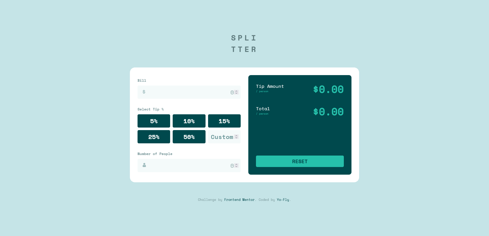

# Tip calculator app solution

This is a solution to the [Tip calculator app challenge on Frontend Mentor](https://www.frontendmentor.io/challenges/tip-calculator-app-ugJNGbJUX).

## Table of contents

- [Overview](#overview)
  - [The challenge](#the-challenge)
  - [Screenshot](#screenshot)
  - [Links](#links)
- [My process](#my-process)
  - [Built with](#built-with)
  - [What I learned](#what-i-learned)
- [Author](#author)

## Overview

### The challenge

Users should be able to:

- View the optimal layout for the app depending on their device's screen size
- See hover states for all interactive elements on the page
- Calculate the correct tip and total cost of the bill per person

### Screenshot

### Links

- Solution URL: [Add solution URL here](https://your-solution-url.com)
- Live Site URL: [Tip Calculator App](https://tip-calculator-yo-fly.netlify.app/)

## My process

### Built with

- HTML5
- SASS
- CSS Grid
- Vanilla JS
- MVC Concept

### What I learned

I used this challenge to improve my knowledge with CSS-Grid and to better understand the MVC concept. Even though it might be too much for this small application, I especially wanted to get a grip on the interactions of Model View and Controller :-)

Happy, I only needed to media-queries to get the app working!

## Author

- Website - [Johannes Fleischhut](https://www.conducto.de)
- Frontend Mentor - [@johannes-fl](https://www.frontendmentor.io/profile/johannes-fl)
- Twitter - [@Yo_Fly86](https://twitter.com/Yo_Fly86)
